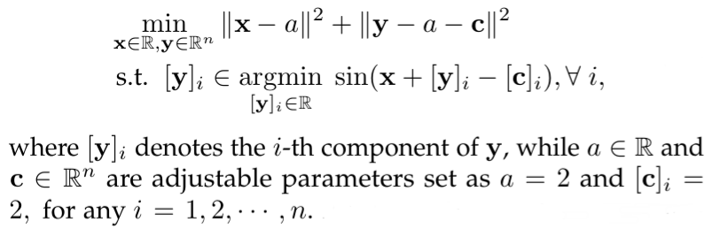

# BVFSM
this is the official code for the paper "Value-Function-based Sequential Minimization for Bi-level Optimization"

## Environment Preparing
```
python 3.6
pytorch 1.6
```

### Training

We provide examples for optimistic BLO.

where $[\mathbf{y}]_i$ denotes the $i$-th component of $\mathbf{y}$, 
while $a \in \mathbb{R}$ and $\mathbf{c}\in \mathbb{R}^n$ are adjustable parameters set as $a=2$ and $[\mathbf{c}]_i=2, \text{ for any }i = 1,2,\cdots,n$. 
You can adjust the algorithm through parameter setting. We will give the default setting in the following example.
The results will be saved in `./result_{time.strftime("%Y_%m_%d_%H_%M_%S")}.csv`
```
python optimistic.py
--size 2         #Lower level problem dimension
--z_loop 50
--y_loop 25
--x_loop 500
--z_lr 0.01
--y_lr 0.01
--x_lr 0.01
--z_L2_reg 0.01  #\mu
--y_L2_reg 0.01  #\theta
--y_ln_reg 0.001 #\sigma^(1)
--x0 0.
--y0 0.
  ```

